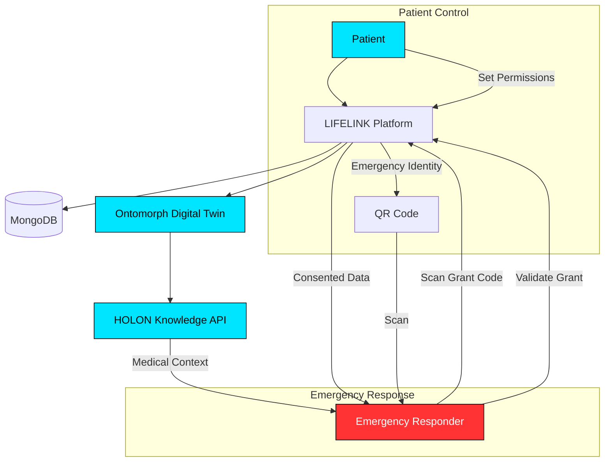

# LIFELINK

<div align="center">
  
### When you cannot speak for yourself, your Digital Twin speaks.

[](https://nextjs.org/)
[](https://www.typescriptlang.org/)
[](https://tailwindcss.com/)
[](https://www.mongodb.com/)
[](https://www.framer.com/motion/)
[](https://ontomorph.com)

</div>

---

## Problem

During medical emergencies, patients are often unconscious, disoriented, or unable to communicate. First responders and doctors arrive with zero context about:

- **Allergies** — Penicillin, latex, iodine, and hundreds of other common triggers
- **Medications** — Blood thinners, insulin, beta-blockers that critically affect emergency treatment
- **Blood type** — Unknown until tested, costing precious minutes
- **Pre-existing conditions** — Heart disease, diabetes, epilepsy that change treatment protocols
- **Emergency contacts** — No way to reach family who know the patient's history

Every minute searching for this information reduces survival probability. The current system — medical records locked in separate hospital databases, paper cards in wallets, or nothing at all — fails precisely when it's needed most.

---

## Solution

**LIFELINK** creates a secure, patient-owned emergency health identity powered by **Ontomorph Digital Twins**.

A patient creates their emergency identity, connects it to their Digital Twin, and sets granular consent permissions. In an emergency, a first responder scans the patient's unique grant code. The responder's device securely connects to the patient's Digital Twin, which delivers only the information the patient has authorized — instantly.

The result: a responder knows about the Warfarin prescription, the peanut allergy, the atrial fibrillation — before the patient can say a word.

---

## Key Features

| Feature | Description |
|---------|-------------|
| **Emergency Digital Identity** | A unique, scannable emergency identity with QR code and grant code |
| **Patient-Owned Consent** | Granular permissions — choose exactly what's shared per emergency |
| **Ontomorph Digital Twin** | Each patient has a secure Digital Twin holding their health context |
| **Emergency Responder Mode** | First responders scan codes to instantly access critical information |
| **HOLON Intelligence** | AI-powered medical knowledge layer provides context-aware summaries |
| **Health Event Timeline** | Track medications, conditions, vital changes, and emergency access |
| **AI Emergency Summaries** | HOLON generates actionable summaries with critical alerts and recommendations |
| **Time-Limited Grants** | Emergency access grants expire automatically — no persistent access |
| **Complete Access Audit** | Every access to patient data is logged and visible |

---

## Architecture



---

## Technology Stack

### Frontend
| Technology | Purpose |
|------------|---------|
| **Next.js 16** | React framework with App Router and Turbopack |
| **TypeScript** | Type-safe development throughout |
| **Tailwind CSS v4** | Utility-first CSS with custom design system |
| **Framer Motion** | Cinematic animations and transitions |
| **Lucide React** | Premium icon library |

### Backend & Data
| Technology | Purpose |
|------------|---------|
| **Next.js API Routes** | Serverless backend endpoints |
| **MongoDB** | Document database with Mongoose ODM |
| **JWT** | Authentication tokens |
| **bcryptjs** | Password hashing |

### AI & Healthcare
| Technology | Purpose |
|------------|---------|
| **Ontomorph SDK** | Digital Twin creation, management, and connection |
| **HOLON API** | Medical knowledge intelligence layer |

---

## Ontomorph Integration

LIFELINK deeply integrates Ontomorph primitives:

### Digital Twins
Each patient creates a secure Ontomorph Digital Twin (`/services/ontomorph/twins.ts`). The Twin holds the patient's health context and is the single source of truth during emergencies.

### Grants
Emergency grants (`/services/ontomorph/grants.ts`) are time-bound permission tokens. A responder's request creates a grant that expires automatically — no long-term access.

### Events
Health events are emitted to the Twin (`/services/ontomorph/events.ts`), creating a chronological record of medications, conditions, vital changes, and emergency access events.

### Flags
Emergency status flags (`/services/ontomorph/flags.ts`) mark the Twin's emergency identity as active or inactive, controlling discoverability.

### Simulation Layer
A mock adapter (`/services/simulation/`) provides realistic Ontomorph behavior when the API is unavailable, making LIFELINK fully functional for hackathon demos.

### HOLON
The HOLON knowledge API (`/services/holon/`) powers the emergency intelligence summary, providing context-aware medical information and critical alerts to responders.

---

## Getting Started

### Prerequisites
- Node.js 18+
- MongoDB (local or Atlas)
- Ontomorph API key
- HOLON API key

### Installation

```bash
# Clone the repository
git clone https://github.com/NACOS-OAU/lifelink-emergency-twin.git
cd lifelink-emergency-twin

# Install dependencies
npm install

# Set up environment variables
cp .env.example .env.local
# Edit .env.local with your credentials

# Start development server
npm run dev

# Build for production
npm run build
npm start
```

---

## Environment Variables

| Variable | Required | Description |
|----------|----------|-------------|
| `ONTOMORPH_API_KEY` | Yes | Ontomorph Digital Twin API key |
| `HOLON_API_KEY` | Yes | HOLON knowledge API key |
| `MONGODB_URI` | Yes | MongoDB connection string |
| `DATABASE_URL` | Alt | Alternative MongoDB connection string |
| `JWT_SECRET` | Yes | Secret key for authentication tokens |
| `ENCRYPTION_KEY` | Yes | Encryption key for sensitive data |

---

## Demo Flow (3-Minute Hackathon Demo)

### Step 1 — Patient Creates Emergency Identity
Navigate to `/onboarding`. Create an account with name, email, and password.

### Step 2 — Digital Twin Connects
Watch the cinematic connection animation as LIFELINK connects to the patient's Ontomorph Digital Twin.

### Step 3 — Set Permissions
Choose exactly what information is shared in emergencies — blood type, allergies, medications, conditions.

### Step 4 — QR Code Generated
The patient receives their unique emergency identity. The QR code and grant code are ready.

### Step 5 — Responder Scans
Open `/responder` in a new browser tab. Enter the emergency grant code displayed on the patient's identity page.

### Step 6 — Twin Information Appears
Critical medical information — allergies, medications, blood type, conditions — appears instantly.

### Step 7 — HOLON Explains Context
The HOLON-powered intelligence summary provides clinical context, critical alerts, and treatment recommendations.

---

## Project Structure

```
src/
├── app/
│   ├── (auth)/           # Login, onboarding, responder
│   ├── (dashboard)/      # Dashboard, identity, twin, timeline, access
│   └── api/              # API routes (auth, identity, grants, events, responder)
├── components/
│   ├── ui/               # Reusable UI components (Button, Input, Card, Badge, etc.)
│   ├── layout/           # Nav, Footer
│   └── landing/          # Landing page sections
├── config/               # Application configuration
├── hooks/                # Custom React hooks
├── lib/                  # Utilities, database connection, auth
├── models/               # Mongoose schemas
├── services/
│   ├── ontomorph/        # Ontomorph SDK integration
│   ├── holon/            # HOLON knowledge API
│   ├── twin/             # Digital Twin orchestration
│   └── simulation/       # Mock adapters
└── types/                # TypeScript type definitions
```

---

## API Reference

### Authentication
| Endpoint | Method | Description |
|----------|--------|-------------|
| `/api/auth/register` | POST | Create account |
| `/api/auth/login` | POST | Sign in |
| `/api/auth/me` | GET | Get current user |

### Emergency Identity
| Endpoint | Method | Description |
|----------|--------|-------------|
| `/api/identity` | GET | Get patient identity |
| `/api/identity` | POST | Create identity |
| `/api/identity` | PUT | Update identity |
| `/api/identity/[identifier]` | GET | Public identity lookup |

### Grants
| Endpoint | Method | Description |
|----------|--------|-------------|
| `/api/grants` | GET | List grants |
| `/api/grants` | POST | Create grant |
| `/api/grants/[code]` | GET | Validate grant code |

### Events & Responder
| Endpoint | Method | Description |
|----------|--------|-------------|
| `/api/events` | GET | List health events |
| `/api/events` | POST | Create event |
| `/api/responder` | POST | Responder access request |

---

## Future Roadmap

- [ ] **Wearable Integration** — Apple Watch, Fitbit, health device sync
- [ ] **Hospital System Integration** — Epic, Cerner, OpenMRS
- [ ] **Plugin Ecosystem** — Third-party health data plugins
- [ ] **AI Emergency Agents** — Autonomous emergency communication agents
- [ ] **Offline Mode** — Local-first emergency identity caching
- [ ] **Multi-language Support** — Emergency translations for responders
- [ ] **Telemedicine Connect** — One-tap video with emergency physicians

---

## Team

**LIFELINK** — Built by a team dedicated to reimagining emergency healthcare through Digital Twin technology.

---

## License

This project is built for demonstration and educational purposes. All rights reserved.
